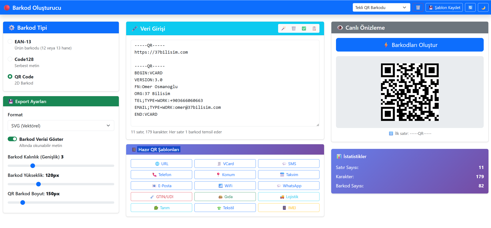
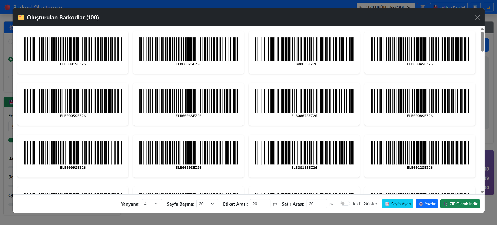
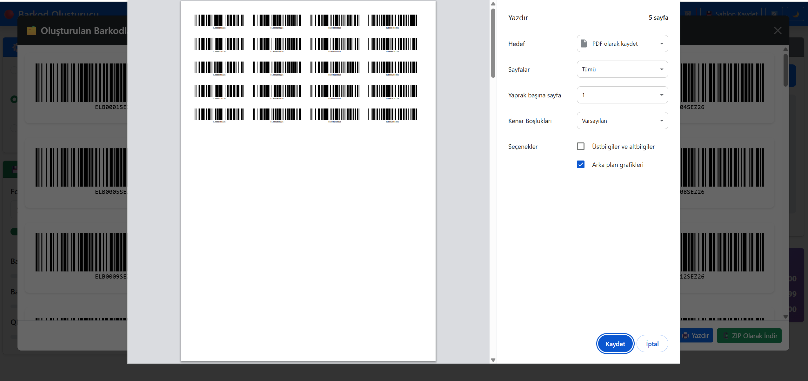

# 🏷️ Barkod Oluşturucu

EAN-13, Code128, QR Code, GS1 ve IMEI destekli ücretsiz barkod oluşturucu.

Tek dosya HTML olarak veya web tarayıcısı üzerinden çalışabilir. Kurulum gerektirmez; Windows, Linux, macOS ve mobil cihazlarda kullanılabilir.

---

## ✨ Özellikler

* EAN-13 barkod oluşturma
* Code128 barkod oluşturma
* QR Code oluşturma
* SVG ve PNG dışa aktarma
* Toplu barkod üretimi
* ZIP olarak indirme
* Yazdırma ve etiket şablonları
* LocalStorage ile şablon kaydetme
* İnternet bağlantısı gerektirmeden tamamen istemci tarafında çalışma
* Hazır QR Şablonları (URL, Vcard, Sms, Telefon, Konum, Takvim, E-Posta, Wifi, Whatsapp)
* GS1 Barkodları ve IMEI Üretme (Tıbbi Cihaz, Gıda, Lojistik, Tarım, Tekstil) IMEI (Telefon, Akıllı Takip Cihazları, Akıll Tarım Ürünleri, M2M Cihazları için)

---

## ✅ Desteklenen Barkod Türleri

### 🔹 EAN-13

Ürün barkodları için 12 veya 13 haneli EAN-13 üretimi ve otomatik kontrol basamağı hesaplama.

### 🔹 Code128

Serbest metin, stok kodu, seri numarası ve işletme içi etiketleme işlemleri.

### 🔹 QR Code

2D barkod desteği ile bağlantı, iletişim ve sektör odaklı veri paylaşımı.

---

## 📌 Hazır QR Şablonları

* 🌐 URL
* 👤 VCard (Kartvizit)
* 💬 SMS
* 📞 Telefon Araması
* 📍 Google Harita Konumu
* 📅 Takvim Etkinliği
* 📧 E-Posta
* 📶 WiFi Bağlantısı
* 💚 WhatsApp Mesajı

---

## 🏭 GS1 ve Sektörel Şablonlar

### 🏥 Tıbbi Cihaz

GTIN, UDI, lot, seri numarası, üretim ve son kullanma tarihi destekleri.

### 🍔 Gıda

GS1 standartlarına uygun ürün, ağırlık, lot ve son tüketim tarihi bilgileri.

### 🚚 Lojistik

SSCC ve GS1-128 uyumlu lojistik etiketleri.

### 🌾 Tarım

Tarımsal ürünlerin izlenebilirliği için GS1 veri alanları.

### 👕 Tekstil

Tekstil ürünleri için yaygın kullanılan GS1 uygulama tanımlayıcıları.

### 📱 IMEI / GSM

Yetkili üreticiler için TAC kodundan IMEI üretimi.

> ⚠️ IMEI üretimi yalnızca kendi cihazlarını üreten firmalar tarafından kullanılmalıdır.

---

## 🎬 Yapabilecekleriniz

* Ücretsiz EAN-13 barkod oluşturma
* Code128 stok ve ürün etiketleri üretme
* QR kodlarla menü, kartvizit ve WiFi paylaşımı
* Toplu barkod üretip ZIP olarak indirme
* SVG veya PNG olarak dışa aktarma
* A4 etiket şablonları hazırlama
* GS1, GTIN ve UDI barkodları oluşturma
* Tıbbi cihaz ve gıda barkodları üretme
* SSCC lojistik etiketleri hazırlama
* IMEI seri numaraları oluşturma
* Şablonları kaydedip tekrar kullanma

---

## 📸 Ekran Görüntüleri

### Ana Ekran



### Canlı Önizleme



### Yazdırma ve Etiketleme



---

## 📂 Proje Yapısı

```text
index.html                 Ana uygulama
script.js                  Uygulama mantığı
style.css                  Arayüz stilleri
barkodTekDosya.html        Tek dosya sürümü
docs/                      Görseller ve dokümantasyon
source/                    Üçüncü parti kütüphaneler
TODO.txt                   Geliştirme notları
```

---

## 📦 Kullanılan Kütüphaneler

* Vue.js
* Bootstrap 5
* JsBarcode https://lindell.me/JsBarcode/ (https://github.com/lindell/JsBarcode)
* QRCode.js https://github.com/jeromeetienne/jquery-qrcode
* JSZip
* FileSaver.js
* html-to-image

---

## 🔒 Gizlilik

Uygulama tamamen tarayıcı içerisinde çalışır.

* Veri sunucuya gönderilmez.
* Şablonlar LocalStorage üzerinde saklanır.
* İnternet bağlantısı olmadan kullanılabilir.
* Kişisel veya ticari bilgiler cihazınızdan dışarı çıkmaz.

---

## 🎥 Eğitim Videosu

Projeyle ilgili ayrıntılı kullanım videosu:

[](https://www.youtube.com/watch?v=C6tTVHFX1kE)

Videoda;

* EAN-13 üretimi
* Code128 kullanımı
* QR şablonları
* GS1 standartları
* Tıbbi cihaz barkodları
* Gıda ve lojistik uygulamaları
* IMEI üretimi
* Etiket yazdırma
* Şablon yönetimi

gibi konular anlatılmaktadır.

---

## 📜 Lisans

MIT License

## 📜 TODO
	
[•] Klavuzlar
* GS1 Code: https://ref.gs1.org/ai/
* IMEI: https://www.gsmaservices.com/my-services/  | https://www.turkiye.gov.tr/btk-imei-kaydet
* GTIN - UDI: - https://utsuygulama.saglik.gov.tr/UTS/vatandas#/vatTibbiCihazListele

[•] Eklenecekler
* 2 etiket arasında boşluk için etiket arasına tag koy
* Etiket yükselik ve genişlik girebilsin